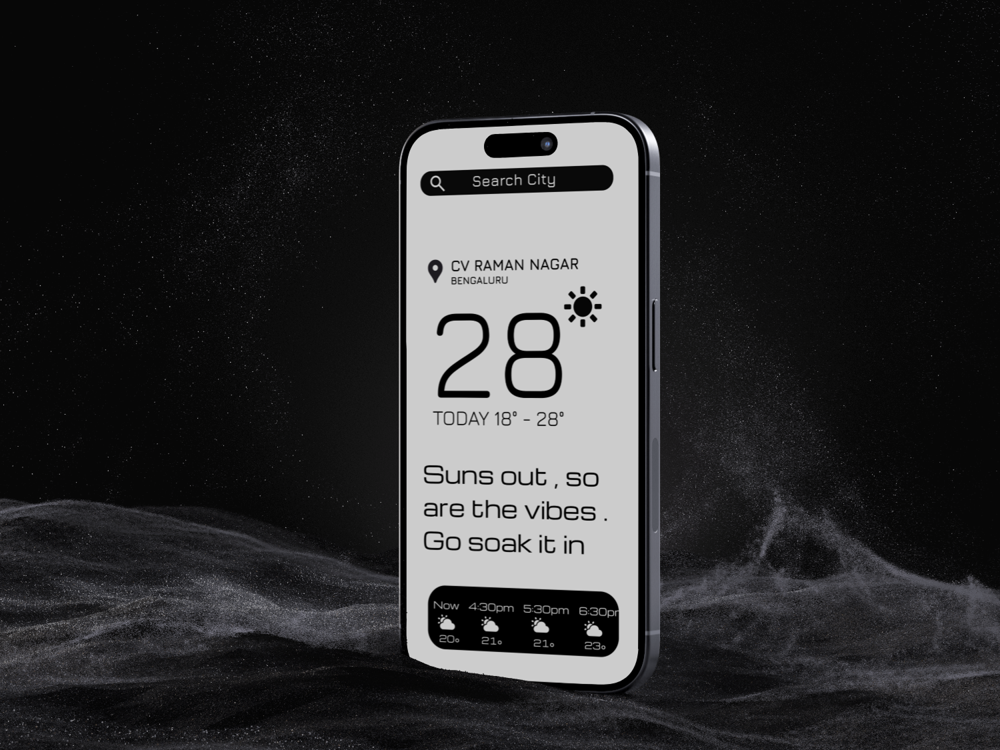

# SKYN - [Not your boaring weather app]
SKYN redefines how you experience weather updates. Unlike the generic default apps, SKYN blends accurate forecasts with a modern, minimal interface that feels sleek, intuitive, and personal.

With a focus on clean design, engaging micro-interactions, and visually rich insights, SKYN makes checking the weather not just a routine—but a refreshing part of your day.
From subtle animations to thoughtful typography, every element is crafted to elevate the user experience and make weather feel aesthetic and human.

Because the weather might be ordinary—
but the way you see it shouldn’t be.

## Features

- Search for weather around the world
- Accurate weather forcast and predictions
- Friendly comments and interactions based on the weather  

## License

[MIT](https://choosealicense.com/licenses/mit/)

## Screenshot

## TEST THE APP NOW 
[**Click here to test the app**](https://saifmk.website/AeroCast_case_study.html)
